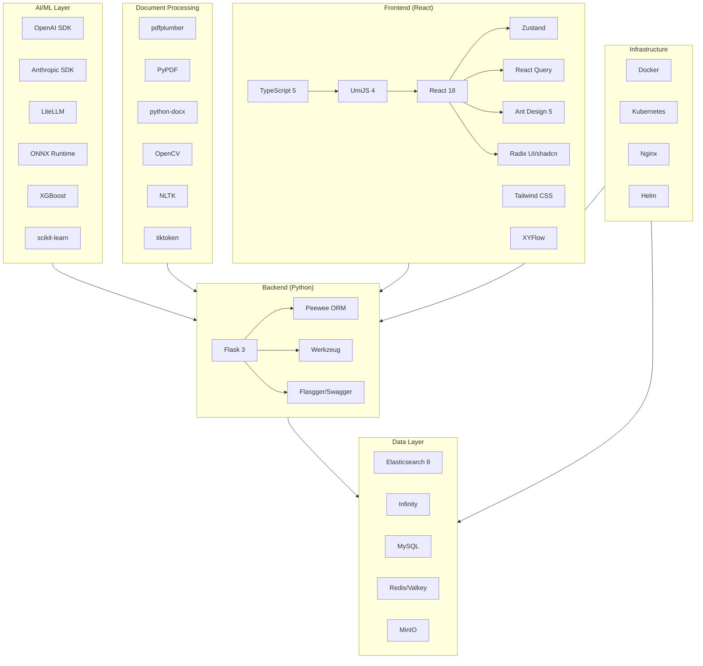
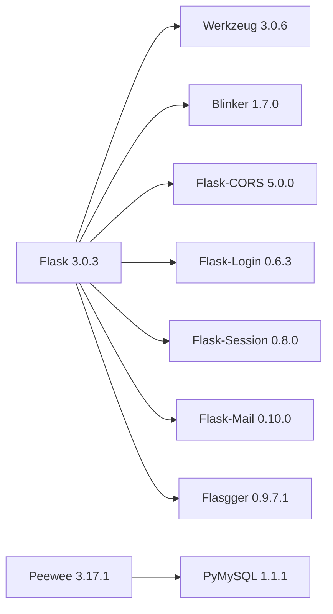
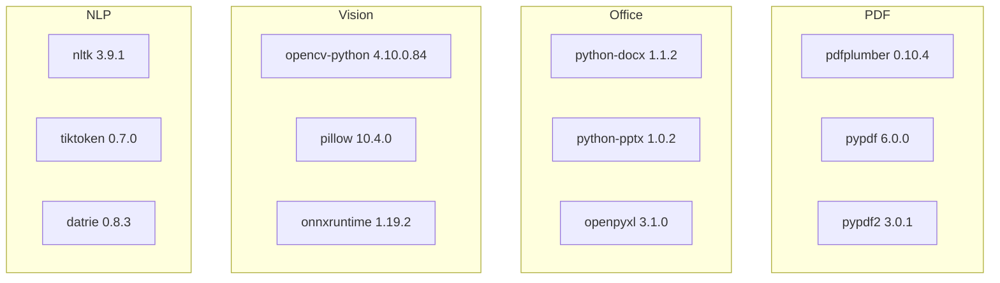
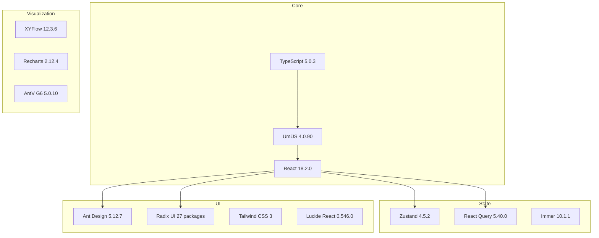
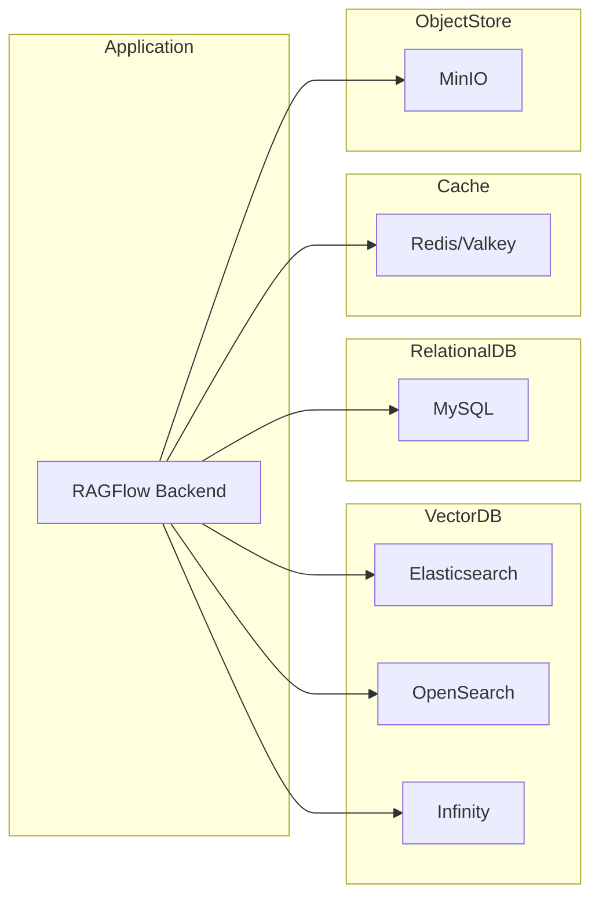
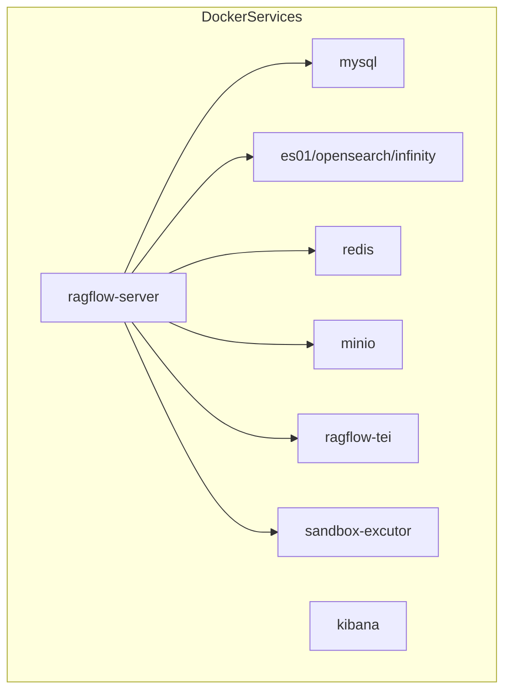

# RAGFlow Dependency Graph

**Commit SHA:** `341e5904c847948d13e339f7df6aacd67ab8b652`

## Technology Stack Visualization

## Core Dependencies by Category

### Python Backend Framework

### LLM Provider Dependencies

| Provider | Package | Version | Purpose |
|----------|---------|---------|---------|
| OpenAI | openai | >= 1.45.0 | GPT models, embeddings |
| Anthropic | anthropic | 0.34.1 | Claude models |
| LiteLLM | litellm | >= 1.74.15 | Universal LLM proxy (26 providers) |
| Google | google-genai | >= 1.41.0 | Gemini models |
| Google | vertexai | 1.70.0 | Vertex AI models |
| Azure | azure-identity | 1.17.1 | Azure authentication |
| Zhipu | zhipuai | 2.0.1 | Zhipu AI (GLM) |
| Baidu | qianfan | 0.4.6 | Baidu Qianfan |
| ByteDance | volcengine | 1.0.194 | Volcano Engine |
| Alibaba | dashscope | 1.20.11 | Tongyi Qianwen |
| Cohere | cohere | 5.6.2 | Cohere embeddings/rerank |
| Mistral | mistralai | 0.4.2 | Mistral models |
| Groq | groq | 0.9.0 | Groq inference |
| Replicate | replicate | 0.31.0 | Replicate models |
| Voyage | voyageai | 0.2.3 | Voyage embeddings |
| Ollama | ollama | >= 0.5.0 | Local models |

### Document Processing Dependencies

### Frontend Component Dependencies

## Data Storage Dependencies

### Primary Data Stores

| Service | Package | Version | Purpose |
|---------|---------|---------|---------|
| Elasticsearch | elasticsearch | 8.12.1 | Vector search, full-text |
| Elasticsearch DSL | elasticsearch-dsl | 8.12.0 | Query building |
| OpenSearch | opensearch-py | 2.7.1 | AWS alternative |
| Infinity | infinity-sdk | 0.6.5 | High-performance alternative |
| Redis | valkey | 6.0.2 | Caching, distributed locks |
| MinIO | minio | 7.2.4 | Object storage |
| MySQL | pymysql | 1.1.1 | Relational data |

### Storage Dependency Flow

## External Service Dependencies

### Search & Web

| Package | Version | Purpose |
|---------|---------|---------|
| tavily-python | 0.5.1 | Web search tool |
| google-search-results | 2.4.2 | Google SERP |
| duckduckgo-search | >= 7.2.0 | DuckDuckGo search |
| Crawl4AI | >= 0.3.8 | Web crawling |
| selenium | 4.22.0 | Browser automation |

### Finance & Research

| Package | Version | Purpose |
|---------|---------|---------|
| yfinance | 0.2.65 | Yahoo Finance |
| akshare | >= 1.15.78 | Chinese financial data |
| scholarly | 1.7.11 | Google Scholar |
| arxiv | 2.1.3 | arXiv papers |
| wikipedia | 1.4.0 | Wikipedia API |

### Communication

| Package | Version | Purpose |
|---------|---------|---------|
| slack-sdk | 3.37.0 | Slack integration |
| discord-py | 2.3.2 | Discord bot |
| jira | 3.10.5 | Jira integration |
| atlassian-python-api | 4.0.7 | Atlassian APIs |

## Infrastructure Dependencies

### Docker Compose Services

### Kubernetes/Helm Dependencies

- Kubernetes >= 1.19
- Helm >= 3.0
- PersistentVolumeClaim support
- Ingress controller (optional)

## Dependency Version Policies

### Pinning Strategy

| Category | Strategy | Example |
|----------|----------|---------|
| Core Framework | Exact version | flask==3.0.3 |
| LLM Providers | Minimum with ceiling | openai>=1.45.0 |
| Minor dependencies | Range | pandas>=2.2.0,<3.0.0 |
| Dev dependencies | Range | pytest>=8.3.5 |

### Update Frequency Recommendations

| Category | Frequency | Rationale |
|----------|-----------|-----------|
| Security patches | Weekly | Critical vulnerabilities |
| LLM SDKs | Monthly | API changes |
| UI frameworks | Quarterly | Breaking changes |
| Core framework | 6 months | Stability |

## Potential Issues

### Heavy Dependencies

| Package | Size | Alternative |
|---------|------|-------------|
| opencv-python | 50MB+ | opencv-python-headless (used) |
| onnxruntime-gpu | 200MB+ | CPU version for non-GPU |
| pytorch (implicit) | 500MB+ | Optional, for some models |

### Deprecation Warnings

- `selenium-wire` 5.1.0 - Uses deprecated APIs
- Some `numpy` usage may need updates for numpy 2.0

### License Considerations

All dependencies appear to be compatible with Apache 2.0 license. Notable licenses:
- Most packages: MIT, BSD, Apache 2.0
- NLTK: Apache 2.0
- OpenCV: Apache 2.0

## Dependency Update Checklist

When updating dependencies:

1. [ ] Check changelog for breaking changes
2. [ ] Run full test suite
3. [ ] Verify LLM provider compatibility
4. [ ] Test document parsing accuracy
5. [ ] Check frontend build
6. [ ] Verify Docker images build
7. [ ] Test Kubernetes deployment
8. [ ] Update documentation if needed
